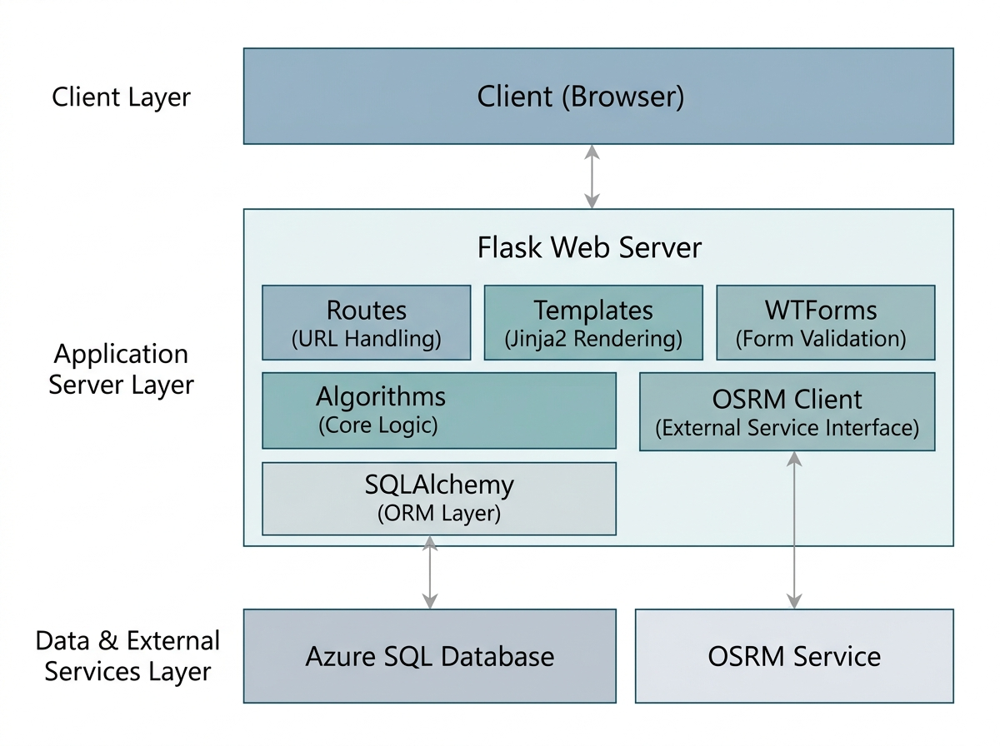

<div align="center">
  <br/>
  
  <h1 align="center" style="margin-top: 8px;">🗺️ Optimize Tourist Routes — GTS</h1>
  <p align="center">
    <strong>Hệ thống tối ưu hóa tuyến đường du lịch thông minh cho Thành phố Hồ Chí Minh</strong>
    <br/>
    Ứng dụng Web sử dụng <b>Greedy TSP (Nearest Neighbor + Multi-Start)</b> kết hợp <b>OSRM API</b> để đề xuất lộ trình tham quan tối ưu.
  </p>
  <div align="center">
    
    
    
    
    
    
    
    
  </div>
  <br/>
</div>

---

## 📑 Mục Lục

- [🌟 Tổng Quan](#-tổng-quan)
- [✨ Tính Năng Chính](#-tính-năng-chính)
- [🧠 Thuật Toán & Kỹ Thuật](#-thuật-toán--kỹ-thuật)
- [🏗️ Kiến Trúc Hệ Thống](#️-kiến-trúc-hệ-thống)
- [🗄️ Cơ Sở Dữ Liệu](#️-cơ-sở-dữ-liệu)
- [⚙️ Cài Đặt & Chạy](#️-cài-đặt--chạy)
- [📖 Hướng Dẫn Sử Dụng](#-hướng-dẫn-sử-dụng)
- [🔌 API Endpoints](#-api-endpoints)
- [🛠️ Công Nghệ Sử Dụng](#️-công-nghệ-sử-dụng)
- [📂 Cấu Trúc Thư Mục](#-cấu-trúc-thư-mục)
- [🤝 Đóng Góp](#-đóng-góp)
- [📄 Giấy Phép](#-giấy-phép)


---

## 🌟 Tổng Quan

**Optimize Tourist Routes — GTS** là một ứng dụng Web được xây dựng bằng **Flask (Python)**, giúp du khách và người dân TP. Hồ Chí Minh dễ dàng lên kế hoạch tham quan với lộ trình **tối ưu về thời gian và khoảng đường di chuyển**.

Ứng dụng sử dụng thuật toán **Greedy TSP (Traveling Salesman Problem)** với chiến lược **Nearest Neighbor kết hợp Multi-Start** để tìm ra thứ tự tham quan hợp lý nhất. Bên cạnh đó, hệ thống tích hợp **OSRM (Open Source Routing Machine)** để tính toán thời gian di chuyển thực tế giữa các điểm đến dựa trên mạng lưới đường xá.

> 🎯 **Mục tiêu:** Giúp du khách tiết kiệm thời gian, chi phí di chuyển và tận hưởng trọn vẹn hành trình khám phá Sài Gòn.

---

## ✨ Tính Năng Chính

### 🏠 Trang Chủ
- Giao diện giới thiệu thành phố với hình ảnh và thông tin điểm đến nổi bật
- Thanh điều hướng trực quan đến tất cả các chức năng
- Hỗ trợ **Dark Mode** / Light Mode với Tailwind CSS
- Responsive trên mọi thiết bị (mobile, tablet, desktop)

### 📍 Chọn Điểm Tham Quan & Tối Ưu Lộ Trình
- Lọc điểm tham quan theo **Quận** và **Loại** (Lịch sử, Văn hóa, Giải trí, Sinh thái, Kiến trúc)
- Chọn nhiều điểm và nhấn **"Tối Ưu Hóa Lộ Trình"**
- Hệ thống sẽ tính toán thứ tự tham quan tối ưu trên bản đồ
- Hiển thị tổng thời gian dự kiến, khoảng cách di chuyển
- Bản đồ mini tích hợp với **Leaflet** và marker đánh số thứ tự

### 🗺️ Bản Đồ Tương Tác (Display Map)
- Xem tất cả điểm tham quan trên bản đồ với **Leaflet + OpenStreetMap**
- Tìm kiếm địa điểm theo tên
- Lọc theo loại điểm tham quan
- Popup hiển thị thông tin chi tiết, hình ảnh
- Nút **"Lộ Trình Tối Ưu"** — vẽ tuyến đường GTS trên bản đồ

### 🧭 Tìm Đường (A → B)
- Chọn điểm xuất phát và điểm đến từ dropdown
- **3 loại tuyến đường:**
  - ⚡ **Nhanh Nhất** — Thời gian di chuyển ngắn nhất (qua OSRM)
  - 📏 **Ngắn Nhất** — Khoảng cách đường đi ngắn nhất (qua OSRM)
  - 🏞️ **Ngắm Cảnh (GTS)** — Đi qua tất cả danh lam thắng cảnh (thuật toán GTS)
- Hiển thị thông tin chi tiết: khoảng cách, thời gian, hướng dẫn từng bước
- Timeline các điểm dừng

### 🛠️ Quản Lý Địa Điểm (CRUD)
- **Thêm** địa điểm mới với: tên, mô tả, địa chỉ, quận, loại, tọa độ, giờ mở/đóng, thời gian tham quan, hình ảnh
- **Sửa** thông tin địa điểm hiện có
- **Xóa** địa điểm khỏi hệ thống
- **Tìm kiếm & lọc** theo quận, loại
- Validate dữ liệu đầu vào

### 🌐 API RESTful
- 8+ API endpoints phục vụ frontend và tích hợp
- Hỗ trợ JSON request/response
- Xử lý lỗi đồng bộ với mã HTTP status code


---

## 🧠 Thuật Toán & Kỹ Thuật

### 🔬 Greedy TSP (GTS) — Nearest Neighbor + Multi-Start

Bài toán tối ưu tuyến đường du lịch được qui về **Bài toán Người Du Lịch (TSP)** — tìm đường đi ngắn nhất qua tất cả các điểm và quay về điểm xuất phát.

**Thuật toán chính:**
1. **Nearest Neighbor (NN):** Xuất phát từ một điểm, luôn chọn điểm chưa đi gần nhất
2. **Multi-Start Greedy:** Thử tất cả các điểm làm điểm xuất phát, chọn ra lộ trình có tổng khoảng cách ngắn nhất
3. **Kết hợp OSRM:** Ưu tiên dùng dữ liệu đường đi thực tế từ OSRM, fallback về Haversine nếu API không khả dụng

### 📐 Công Thức Haversine

Tính khoảng đường chim bay giữa hai điểm trên mặt cầu Trái Đất:

```
a = sin²(Δφ/2) + cos φ1 · cos φ2 · sin²(Δλ/2)
c = 2 · atan2(√a, √(1−a))
d = R · c   (R = 6371 km)
```

### 🚗 OSRM API

Tích hợp **Open Source Routing Machine** (router.project-osrm.org) để lấy:
- Khoảng cách thực tế trên đường bộ
- Thời gian di chuyển ước tính
- Hướng dẫn chi tiết từng chặng (tên đường, hướng rẽ, độ dài)
- Hỗ trợ 3 loại tuyến: fastest, shortest, scenic

### ⚡ Cải Tiến Hiệu Năng

| Chiến lược | Mô tả |
|---|---|
| **Multi-Start Greedy** | Thử `n` lần với mỗi điểm làm xuất phát, chọn lộ trình ngắn nhất |
| **So sánh OSRM vs Greedy** | Khi bật cả hai, hệ thống chạy song song và chọn kết quả tốt hơn |
| **Fallback tự động** | Nếu OSRM lỗi (timeout/network), tự động dùng Greedy thuần |
| **Timeout thông minh** | 5s cho single route request, 10s cho batch request |


---

## 🏗️ Kiến Trúc Hệ Thống


---

## 🗄️ Cơ Sở Dữ Liệu

### Mô Hình Quan Hệ (ERD)

```
┌──────────────┐       ┌──────────────────┐       ┌──────────────┐
│    Quan      │       │   DiemThamQuan   │       │LoaiDiemThamQ.│
├──────────────┤       ├──────────────────┤       ├──────────────┤
│ QuanID (PK)  │◄──────┤ DiemID (PK)      │       │ LoaiID (PK)  │
│ TenQuan      │       │ TenDiem          │◄──────┤ TenLoai      │
│ MoTa         │       │ MoTa             │       │ MoTa         │
└──────────────┘       │ DiaChi           │       └──────────────┘
                       │ QuanID (FK)      │
                       │ LoaiID (FK)      │
                       │ ViDo             │
                       │ KinhDo           │       ┌──────────────┐
                       │ GioMoCua         │       │ HinhAnhDiem  │
                       │ GioDongCua       │       ├──────────────┤
                       │ Duration         │◄─────►│ HinhID  (PK) │
                       └──────────────────┘       │ DiemID (FK)  │
                                                  │ UrlHinh      │
                                                  │ MoTaHinh     │
                                                  └──────────────┘
```

### Bảng Dữ Liệu

| Bảng | Mô tả |
|------|-------|
| `Quan` | Danh sách quận/huyện tại TP.HCM |
| `LoaiDiemThamQuan` | Phân loại điểm tham quan (Lịch sử, Văn hóa, Giải trí, Sinh thái, Kiến trúc) |
| `DiemThamQuan` | Thông tin chi tiết từng điểm tham quan (tọa độ, giờ mở cửa, thời gian tham quan...) |
| `HinhAnhDiem` | Hình ảnh của các điểm tham quan |

### Data Seed

Script SQL đi kèm (`GTS_optimizeroutes.sql`) bao gồm dữ liệu mẫu cho **9 điểm tham quan nổi tiếng**:
- Dinh Độc Lập, Nhà thờ Đức Bà, Chợ Bến Thành (Quận 1)
- Bảo tàng Chứng tích Chiến tranh (Quận 3)
- Chùa Bà Thiên Hậu (Quận 5)
- Crescent Mall, Hồ Bán Nguyệt & Cầu Ánh Sao (Quận 7)
- Khu du lịch Suối Tiên, Chùa Bửu Long (Thủ Đức)


---

## ⚙️ Cài Đặt & Chạy

### Yêu Cầu Hệ Thống

- **Python** 3.10+
- **ODBC Driver 18 for SQL Server** (hoặc tương thích)
- Kết nối Internet (cho OSRM API, Leaflet CDN, Google Fonts)

### 1. Clone Repository

```bash
git clone https://github.com/your-username/OptimizeTouristRoutes_GTS.git
cd OptimizeTouristRoutes_GTS
```

### 2. Tạo Môi Trường Ảo & Cài Dependencies

```bash
python -m venv venv
# Windows:
venv\Scripts\activate
# macOS/Linux:
source venv/bin/activate

pip install -r requirements.txt
```

### 3. Cấu Hình Database

Tạo database SQL Server (Azure hoặc on-premise) và chạy script:

```bash
sqlcmd -S your_server -U your_user -d your_database -i GTS_optimizeroutes.sql
```

### 4. Cấu Hình Môi Trường

Thiết lập biến môi trường (khuyến nghị cho production):

```bash
# Windows PowerShell:
$env:SECRET_KEY="your-strong-secret-key"
$env:DB_PASSWORD="your-database-password"
# hoặc chuỗi ODBC đầy đủ:
$env:DATABASE_URL_ODBC="Driver={ODBC Driver 18 for SQL Server};Server=tcp:your-server.database.windows.net,1433;Database=OptimizeTouristRoutesDB;Uid=your_user;Pwd=your_password;Encrypt=yes;TrustServerCertificate=no;Connection Timeout=30;"
```

Hoặc sửa trực tiếp file `config.py` (chỉ dùng cho dev).

### 5. Chạy Ứng Dụng

```bash
# Development Mode:
python run.py

# Production Mode (với Gunicorn / Waitress):
pip install waitress
waitress-serve --host=0.0.0.0 --port=5000 app:app
```

Truy cập: **http://localhost:5000** 🚀


---

## 📖 Hướng Dẫn Sử Dụng

### 🎯 Tối ưu lộ trình tham quan nhiều điểm

| Bước | Thao tác | Mô tả |
|------|----------|-------|
| 1 | Vào **"Lộ Trình Tối Ưu (GTS)"** | Trang chọn điểm tham quan |
| 2 | Lọc quận/loại | Thu hẹp danh sách điểm |
| 3 | **Check** các điểm muốn đi | Chọn ít nhất 2 điểm |
| 4 | Nhấn **"Tối Ưu Hóa Lộ Trình"** | Hệ thống tính toán route |
| 5 | Xem kết quả | Bản đồ hiển thị số thứ tự + polyline |

### 🗺️ Khám phá bản đồ

- Vào **"Bản Đồ"** để xem toàn bộ điểm tham quan
- Click marker để xem popup thông tin
- Dùng thanh tìm kiếm và nút lọc để tìm nhanh
- Nhấn **"Lộ Trình Tối Ưu"** để vẽ route GTS

### 🧭 Tìm đường A → B

- Vào **"Tìm Đường (A-B)"**
- Chọn điểm đi và điểm đến
- Chọn loại tuyến đường (Nhanh nhất / Ngắn nhất / Ngắm cảnh GTS)
- Xem kết quả chi tiết: quãng đường, thời gian, hướng dẫn từng chặng

### 🛠️ Quản lý điểm tham quan

- Vào **"Quản Lý Địa Điểm"**
- **Thêm mới:** Nhấn nút "Thêm Địa Điểm Mới" → điền form
- **Sửa:** Nhấn icon ✏️ trên hàng tương ứng
- **Xóa:** Nhấn icon 🗑️ → xác nhận
- **Tìm kiếm:** Gõ tên hoặc lọc theo quận/loại


---

## 🔌 API Endpoints

### 📍 Điểm Tham Quan

| Method | Endpoint | Mô tả |
|--------|----------|-------|
| `GET` | `/api/locations` | Lấy danh sách tất cả địa điểm (dùng cho find_route) |
| `GET` | `/api/manage/locations` | Lấy toàn bộ địa điểm + quan hệ (cho quản lý) |
| `GET` | `/api/manage/locations/<id>` | Lấy chi tiết một địa điểm |
| `POST` | `/api/manage/locations` | Tạo địa điểm mới |
| `PUT` | `/api/manage/locations/<id>` | Cập nhật thông tin địa điểm |
| `DELETE` | `/api/manage/locations/<id>` | Xóa một địa điểm |

### 🚗 Định Tuyến

| Method | Endpoint | Mô tả |
|--------|----------|-------|
| `POST` | `/api/find-route` | Tìm đường A→B (fastest/shortest/scenic) |
| `POST` | `/api/route_optimize` | Tối ưu lộ trình tham quan nhiều điểm (Greedy TSP) |

### 🌐 Trang Web

| Method | Endpoint | Mô tả |
|--------|----------|-------|
| `GET` | `/` hoặc `/homepage` | Trang chủ |
| `GET/POST` | `/select_points` | Chọn điểm tham quan & tối ưu |
| `GET` | `/display_map` | Bản đồ tương tác |
| `GET` | `/find_route` | Tìm đường A→B |
| `GET` | `/manage_locations` | Quản lý địa điểm |


---

## 🛠️ Công Nghệ Sử Dụng

### Backend
| Công nghệ | Phiên bản | Mục đích |
|-----------|-----------|----------|
|  | 3.10+ | Ngôn ngữ lập trình |
|  | 2.2+ | Web framework |
|  | 1.4+ | ORM database |
|  | 4.0+ | Kết nối SQL Server |
|  | 2.28+ | HTTP client cho OSRM |

### Frontend
| Công nghệ | Mục đích |
|-----------|----------|
|  | Cấu trúc trang |
|  | Template engine |
|  | Utility CSS (homepage) |
|  | UI framework (sub-pages) |
|  | Client logic |
|  | Bản đồ tương tác |
|  | Nền bản đồ |

### Database & Infrastructure
| Công nghệ | Mục đích |
|-----------|----------|
|  | Database |
|  | Cloud hosting (Azure SQL) |
|  | Định tuyến thời gian thực |

### Fonts & Icons
| Công nghệ | Mục đích |
|-----------|----------|
| Google Fonts (Plus Jakarta Sans) | Typography |
| Material Symbols | Icon set (homepage) |
| Bootstrap Icons | Icon set (sub-pages) |
| Font Awesome 6 | Icon set (display_map, manage) |


---

## 📂 Cấu Trúc Thư Mục

```
OptimizeTouristRoutes_GTS/
│
├── run.py                         # Entry point — chạy ứng dụng Flask
├── config.py                      # Cấu hình (DB URI, Secret Key, v.v.)
├── requirements.txt               # Danh sách dependencies
├── GTS_optimizeroutes.sql         # Script tạo DB + seed data
│
├── app/                           # Package chính
│   ├── __init__.py                # Khởi tạo Flask app, SQLAlchemy
│   ├── routes.py                  # Định nghĩa tất cả routes & API endpoints
│   ├── models.py                  # ORM models (Quan, LoaiDiem, DiemThamQuan, HinhAnh)
│   ├── forms.py                   # Form WTF (đang phát triển)
│   ├── utils.py                   # Hàm tiện ích (đang phát triển)
│   │
│   ├── algorithms/                # Thuật toán tối ưu
│   │   └── gts.py                 # Greedy TSP: Haversine, NN, Multi-Start, OSRM
│   │
│   ├── templates/                 # Jinja2 templates
│   │   ├── base.html              # Layout chung (Bootstrap + Leaflet)
│   │   ├── homepage.html          # Trang chủ (Tailwind CSS)
│   │   ├── select_points.html     # Chọn điểm + tối ưu GTS
│   │   ├── display_map.html       # Bản đồ tương tác
│   │   ├── find_route.html        # Tìm đường A→B
│   │   └── manage_locations.html  # Quản lý CRUD địa điểm
│   │
│   └── static/                    # Tài nguyên tĩnh
│       ├── css/
│       │   └── main.css           # CSS tùy chỉnh
│       ├── js/
│       │   ├── map.js             # Xử lý bản đồ (Leaflet)
│       │   ├── select.js          # UI chọn điểm + tối ưu
│       │   └── tim_duong.js       # UI tìm đường A→B
│       └── images/
│           └── placeholder.png    # Hình ảnh mặc định
│
└── README.md                      

```
---

## 🤝 Đóng Góp

Mọi đóng góp đều được chào đón! Hãy thực hiện các bước sau:

1. **Fork** repository
2. Tạo nhánh mới: `git checkout -b feature/amazing-feature`
3. **Commit** thay đổi: `git commit -m 'Add amazing feature'`
4. **Push** lên nhánh: `git push origin feature/amazing-feature`
5. Tạo **Pull Request**


---

## 📄 Giấy Phép

Dự án được phân phối dưới giấy phép **MIT License**. Xem file `LICENSE` để biết thêm chi tiết.

---

<div align="center">
  <hr style="width: 60%; margin: 20px auto;"/>
  <p>
    <strong>Design by Thành Phát, Gia Khang, Văn Hạo</strong> 🎓
    <br/>
    <sub>© 2025 Optimize Tourist Routes — GTS. All rights reserved.</sub>
    <br/>
    <sub>Made with ❤️ and ☕ for the tourism of Sài Gòn</sub>
  </p>
  <br/>
  <p>
    <a href="#-tổng-quan">⬆ Lên đầu trang</a>
  </p>
</div>

